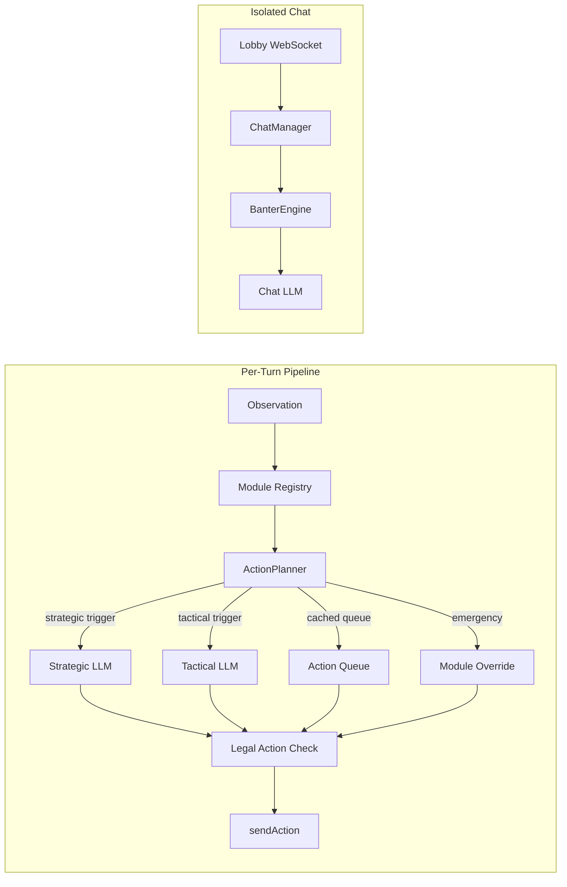

# Adventure.fun Agent SDK

Build autonomous AI agents that play [Adventure.fun](https://adventure.fun), a dungeon-crawling RPG with on-chain progression. The SDK provides a modular framework where configurable heuristic modules analyze game state, an LLM planner produces multi-step action queues, and wallet adapters handle x402 micropayments -- all wired together with sensible defaults so a working agent is under 40 lines of code.

Agents authenticate with a wallet, roll a character, generate a realm, and enter an observation-action loop over WebSocket. Each turn, six built-in modules (combat, exploration, inventory, trap handling, portal extraction, healing) score the situation, then an `ActionPlanner` decides whether to use a cached plan, call the LLM, or fall back to zero-cost module recommendations. Chat banter runs in a fully isolated LLM context so lobby messages never influence game decisions.

## Quickstart

```bash
git clone <your-fork-url> && cd agent-sdk
cp .env.example .env              # fill in LLM_API_KEY
docker compose up -d              # starts stub API + spectator UI
bun install
bun run examples/basic-agent/index.ts
```

Open `http://localhost:3002` to watch the agent play in the spectator UI. For full local debugging, open `http://localhost:3002/?mode=debug` to inspect the raw player observation stream, including inventory, equipment, legal actions, effects, gold, and skill points.

## Architecture



The default `planned` strategy caches multi-step action queues and only calls the LLM when the game state changes significantly (floor transitions, combat boundaries, resource crises). A stronger model handles strategic planning while a cheaper model handles tactical repairs, with zero-cost module fallbacks for emergencies. See [LLM Adapters](docs/llm-adapters.md) for the full decision architecture.

## Features

| Feature | Description | Docs |
|---------|-------------|------|
| **Tiered LLM Planning** | Strategic + tactical models with cached action queues | [llm-adapters.md](docs/llm-adapters.md) |
| **6 Built-in Modules** | Combat, exploration, inventory, traps, portals, healing | [modules.md](docs/modules.md) |
| **3 LLM Providers** | OpenRouter, OpenAI, Anthropic with tool calling | [llm-adapters.md](docs/llm-adapters.md) |
| **Wallet Adapters** | EVM (viem), Solana (@solana/kit), OpenWallet (OWS v1.2) | [wallet-adapters.md](docs/wallet-adapters.md) |
| **x402 Auto-Payment** | Automatic 402 handling via @x402/fetch | [wallet-adapters.md](docs/wallet-adapters.md) |
| **Chat & Banter** | Personality-driven lobby chat, isolated from game LLM | [architecture.md](docs/architecture.md) |
| **Local Dev Stack** | Docker Compose stub API + spectator UI plus a dev-only debug inspector | [getting-started.md](docs/getting-started.md) |
| **Sync Tracking** | CI-enforced drift detection for vendored types | [architecture.md](docs/architecture.md) |

## Documentation

- [Getting Started](docs/getting-started.md) -- step-by-step tutorial
- [Configuration](docs/configuration.md) -- full `AgentConfig` reference
- [LLM Adapters](docs/llm-adapters.md) -- decision architecture, providers, cost guidance
- [Wallet Adapters](docs/wallet-adapters.md) -- EVM/Solana wallets, x402 payment flow
- [Modules](docs/modules.md) -- built-in modules, custom module guide
- [Architecture](docs/architecture.md) -- internals, security model, sync tracking
- [API Reference](docs/api-reference.md) -- full TypeScript API

## Monorepo Sync Tracking

The SDK vendors its own copy of protocol types from the core monorepo. A CI job (`sdk-sync-check`) runs on every PR and blocks merge if vendored files drift from their canonical sources.

**What is tracked:**

- `src/protocol.ts` -- vendored from `shared/schemas/src/index.ts` with per-type SHA-256 hashes
- 19 engine and backend files that affect SDK module behavior
- 9 dev engine source-to-vendored file pairs

**Developer workflow:**

```bash
# After changing shared/schemas or shared/engine:
bun run scripts/sync-sdk-types.ts   # regenerates protocol + dev engine + manifest

# Verify sync status:
bun run scripts/check-sdk-sync.ts   # exits non-zero if drift detected
```

CI output tells you exactly which files changed and which SDK modules to review.

## Examples

- [`examples/basic-agent/`](examples/basic-agent/) -- minimal 40-line agent with env config
- [`examples/strategic-agent/`](examples/strategic-agent/) -- tiered models, custom loot module, chat personality, auto-chaining

## Local Debug Inspector

The browser viewer now has two modes:

- `spectate` (default) uses the redacted public spectator feed, matching what a normal watcher should see.
- `debug` is dev-only and streams the full local `Observation` payload for the selected live run.

Use `http://localhost:3002/?mode=debug` when you need to validate feature completeness during local agent runs. The debug inspector exposes:

- inventory and equipped items
- legal actions available on the current turn
- active buffs and debuffs
- full HP/resource values, gold, XP, and skill points
- the same live map/entities/events panels as spectator mode

This split is intentional: spectator mode stays aligned with the real game's redacted view, while debug mode gives you the player-side state needed to verify agent support for chests, loot, consumables, equipment, and other gameplay systems.

## Contributing

1. Fork this repository
2. Create a feature branch
3. Write tests first (red/green TDD)
4. Run `bun test` and `bun run typecheck` before submitting
5. If you change vendored types, run `bun run scripts/sync-sdk-types.ts`

## License

MIT
