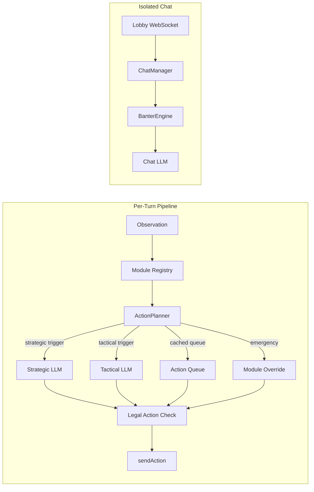

# Adventure.fun Agent SDK

Build autonomous AI agents that play [Adventure.fun](https://adventure.fun), a dungeon-crawling RPG with on-chain progression. The SDK provides a modular framework where configurable heuristic modules analyze game state, an LLM planner produces multi-step action queues, and wallet adapters handle x402 micropayments -- all wired together with sensible defaults so a working agent is ~40 lines of code.

Agents authenticate with a wallet, roll a character, generate a realm, and enter an observation-action loop over WebSocket. Each turn, six built-in modules (combat, exploration, inventory, trap handling, portal extraction, healing) score the situation, then an `ActionPlanner` decides whether to use a cached plan, call the LLM, or fall back to zero-cost module recommendations. Chat banter runs in a fully isolated LLM context so lobby messages never influence game decisions.

## Quickstart

```bash
git clone <your-fork-url> && cd agent-sdk
cp .env.example .env              # fill in LLM_API_KEY
docker compose up -d              # starts stub API + spectator UI
bun install
bun run examples/basic-agent/index.ts
```

Open `http://localhost:3002` to watch the agent play in the spectator UI. For full local debugging, open `http://localhost:3002/?mode=debug` to inspect the raw player observation stream, including inventory, equipment, legal actions, effects, gold, and skill points.

## Running against production

The Quickstart above points the agent at the local Docker stub API. To run against the live Adventure.fun backend, update your `.env` with the production endpoints, switch your wallet to a mainnet network, and fund it with real USDC.

### Env changes

```bash
# API / WebSocket — production backend
API_URL=https://api.adventure.fun
WS_URL=wss://api.adventure.fun

# Wallet network — mainnet instead of testnet
AGENT_WALLET_NETWORK=base          # or: solana
# (Supported: base, base-sepolia, solana, solana-devnet)

# If using OpenWallet, point at the mainnet chain id
OWS_CHAIN_ID=eip155:8453           # Base mainnet

# Use a wallet that actually holds USDC on the chosen network.
AGENT_PRIVATE_KEY=<your-mainnet-private-key>
```

Note the `wss://` (TLS WebSocket) scheme for production — `ws://` will be rejected by the browser and most runtimes over HTTPS.

### Funding the agent wallet

Paid actions on the live backend cost real USDC via x402:

- Realm generation (`PRICE_REALM_GENERATE`)
- Realm regeneration (`PRICE_REALM_REGEN`)
- Inn rest (`PRICE_INN_REST`)
- Stat reroll (`PRICE_STAT_REROLL`)

Current prices are published at `GET https://api.adventure.fun/config/prices`. Fund the agent wallet with enough USDC on your chosen chain (Base mainnet or Solana mainnet) to cover your expected run. Use `MAX_SPEND_USD` and `SPENDING_WINDOW` to cap budget — the SDK will stop starting new realms once the cap is hit.

The in-realm WebSocket session itself does not incur x402 spend; only the paid HTTP actions above do.

### Docker compose and the stub API

The `docker compose up -d` step in the Quickstart starts a **local stub API** intended for offline development and tests. Do not point the stub at production data. When running against `https://api.adventure.fun`, skip `docker compose up` and just run the agent directly:

```bash
bun install
bun run examples/basic-agent/index.ts
```

### Security checklist before going live

- `AGENT_PRIVATE_KEY` is a real mainnet key — keep it in a secrets manager, not committed to git or your dotfiles.
- `LLM_API_KEY` is a paid key — rotate if it ever leaves your machine.
- `SESSION_SECRET` is irrelevant for the SDK itself (that belongs to the server), but if you bring your own backend, generate a fresh one with `openssl rand -hex 32`.
- Never log raw observation payloads if you run agents with other people's wallets.

## Architecture



The default `planned` strategy caches multi-step action queues and only calls the LLM when the game state changes significantly (floor transitions, combat boundaries, resource crises). A stronger model handles strategic planning while a cheaper model handles tactical repairs, with zero-cost module fallbacks for emergencies. See [LLM Adapters](docs/llm-adapters.md) for the full decision architecture.

## Features

| Feature | Description | Docs |
|---------|-------------|------|
| **Tiered LLM Planning** | Strategic + tactical models with cached action queues | [llm-adapters.md](docs/llm-adapters.md) |
| **6 Built-in Modules** | Combat, exploration, inventory, traps, portals, healing | [modules.md](docs/modules.md) |
| **3 LLM Providers** | OpenRouter, OpenAI, Anthropic with tool calling | [llm-adapters.md](docs/llm-adapters.md) |
| **Wallet Adapters** | EVM (viem), Solana (@solana/kit), OpenWallet (OWS v1.2) | [wallet-adapters.md](docs/wallet-adapters.md) |
| **x402 Auto-Payment** | Automatic 402 handling via @x402/fetch plus optional spending caps | [wallet-adapters.md](docs/wallet-adapters.md) |
| **Agent Lifecycle Automation** | Auto progression, LLM lobby planning, and run/activity guardrails | [configuration.md](docs/configuration.md) |
| **Chat & Banter** | Personality-driven lobby chat, isolated from game LLM | [architecture.md](docs/architecture.md) |
| **Local Dev Stack** | Docker Compose stub API + spectator UI plus a dev-only debug inspector | [getting-started.md](docs/getting-started.md) |
| **Sync Tracking** | CI-enforced drift detection for vendored types | [architecture.md](docs/architecture.md) |

## Documentation

- [Getting Started](docs/getting-started.md) -- step-by-step tutorial
- [Configuration](docs/configuration.md) -- full `AgentConfig` reference
- [LLM Adapters](docs/llm-adapters.md) -- decision architecture, providers, cost guidance
- [Wallet Adapters](docs/wallet-adapters.md) -- EVM/Solana wallets, x402 payment flow
- [Modules](docs/modules.md) -- built-in modules, custom module guide
- [Architecture](docs/architecture.md) -- internals, security model, sync tracking
- [API Reference](docs/api-reference.md) -- full TypeScript API
- [llms.txt](llms.txt) -- machine-readable index for LLM-assisted development (Cursor / Claude Code / Copilot)

## Monorepo Sync Tracking

The SDK vendors its own copy of protocol types from the core monorepo. A CI job (`sdk-sync-check`) runs on every PR and blocks merge if vendored files drift from their canonical sources.

**What is tracked:**

- `src/protocol.ts` -- vendored from `shared/schemas/src/index.ts` with per-type SHA-256 hashes
- 19 engine and backend files that affect SDK module behavior
- 9 dev engine source-to-vendored file pairs

**Developer workflow:**

```bash
# After changing shared/schemas or shared/engine:
bun run scripts/sync-sdk-types.ts   # regenerates protocol + dev engine + manifest

# Verify sync status:
bun run scripts/check-sdk-sync.ts   # exits non-zero if drift detected
```

CI output tells you exactly which files changed and which SDK modules to review.

## Examples

Five reference agents, in increasing order of complexity. Each is self-contained — `config.ts` + `index.ts` + (optionally) `supervisor.ts` + a `tests/` directory — so you can copy a whole folder as the starting point for your own agent. The `super-agent` and `hybrid-agent` examples ship a `supervisor.ts` crash-loop wrapper (exponential backoff 2s → 60s, SIGTERM/SIGINT graceful shutdown) intended as the Docker entrypoint.

### Dungeon agents

- [`examples/basic-agent/`](examples/basic-agent/) -- minimal 40-line agent with env config.
- [`examples/strategic-agent/`](examples/strategic-agent/) -- tiered models, custom loot module, chat personality, auto progression, lobby planning, and spending limits.
- [`examples/super-agent/`](examples/super-agent/) -- the most capable dungeon-only reference agent. Adds item-magnet + interactable-router BFS modules, an ability-aware combat module driven by per-class tactical rubrics, a SQLite `WorldModel` that persists realm stats / kill-death history / shop prices / blocked-door memory across container restarts, and a lobby-hook `BudgetPlanner` that gears up with historical price context. Also demonstrates the `lobbyHook` extension point and the shared `bfs` helper. See its [README](examples/super-agent/README.md) for the Docker supervisor setup and WorldModel volume layout.

### Arena agents (4-player PvP)

- [`examples/arena-agent/`](examples/arena-agent/) -- pure arena example. Authenticates, calls `POST /arena/queue`, polls `GET /arena/queue/status` for a `match_id`, then connects to `GET /arena/match/:id/play` and pumps arena-specific modules (`arena-cowardice-avoidance`, `arena-combat`, `arena-positioning`, `arena-chest-looter`, `arena-wave-predictor`) through an `ArenaPromptAdapter` that injects the initiative / cowardice / sudden-death rules and a class-specific PvP rubric. Deliberately does **not** use `BaseAgent` — arena matches have no lobby / realm-progression loop, so the dungeon pipeline would be dead code. Bracket is selected via `ARENA_BRACKET=rookie|veteran|champion`. See its [README](examples/arena-agent/README.md) for the module priority ladder and prompt layout.
- [`examples/hybrid-agent/`](examples/hybrid-agent/) -- the most capable reference agent overall. A supervisor that rotates a single character between dungeons and arena matches via a pure, test-covered state machine (`HUB_IDLE → RUN_DUNGEON → HUB_POST_DUNGEON → {RUN_DUNGEON | QUEUE_ARENA} → IN_ARENA → HUB_POST_ARENA → RUN_DUNGEON`). Composes — not extends — the super-agent `WorldModel` so dungeon runs use the exact module stack from `super-agent` while arena matches use the exact module stack from `arena-agent`; the hybrid layer only adds three tables (`arena_results`, `arena_queue_history`, `gold_history`) on the same SQLite handle. Decision heuristics (`shouldEnterArena`, `shouldBuyGearFirst`, bracket downgrade, losing-streak cooldown) live in a pure [`src/policy.ts`](examples/hybrid-agent/src/policy.ts) so every edge is covered without the network. See its [README](examples/hybrid-agent/README.md) for the state machine diagram, tunable thresholds, and the full env-var surface.

All five examples share the same `.env` schema — switching between them is a one-line change to the `bun run …` target.

## Agent Lifecycle

The SDK now supports full chained runs inside `BaseAgent.start()`:

- successful extractions can automatically continue into the next realm
- `realmProgression.strategy: "auto"` walks realm templates in `orderIndex` order via `GET /content/realms`
- a between-run lobby phase can heal, equip upgrades, sell conservative junk, and buy essentials
- lobby decisions can be LLM-driven with a heuristic fallback
- `limits.maxRealms`, `limits.maxRuntimeMinutes`, `limits.maxSpendUsd`, and `limits.spendingWindow` let you cap activity and x402 spend

The x402 spending cap only applies outside of active realm gameplay. Realm entry/generation, stat rerolls, and inn rests are paid HTTP actions; the in-realm WebSocket session itself does not incur x402 spend.

### Progression: skill tree + perks (deterministic, **you must opt in**)

Adventure.fun has two independent progression tracks:

1. **Tier choices** — one mutually-exclusive class-defining pick at levels 3, 6, and 10. Milestone rewards, not point-gated.
2. **Perks** — 1 perk point per level-up, spent on a shared pool of stackable passive stat buffs (HP, attack, defense, etc.) up to each perk's `max_stacks` cap.

**The SDK does not drive either track through the LLM.** The built-in between-run `maybeSpendSkillPoints` and `maybeSpendPerks` passes are both fully deterministic — they walk the `preferredNodes` / `preferredPerks` lists you configure and do nothing else. Unconfigured agents accumulate unclaimed tier slots and unspent perk points forever, which is a real gameplay loss over time since max-level characters earn ~19 perk points worth of stat stacks.

If you want your agent to progress, **you must opt in** by providing both config blocks:

```typescript
createDefaultConfig({
  // ... your other config ...
  skillTree: {
    autoSpend: true,
    // Tier choices unlock at levels 3, 6, 10 — one pick per tier. List in priority order.
    preferredNodes: ["rogue-t1-disarm-trap", "rogue-t2-envenom", "rogue-t3-death-mark"],
  },
  perks: {
    autoSpend: true,
    // Round-robin — the agent alternates stacks across this list so priorities stay balanced.
    preferredPerks: ["perk-sharpness", "perk-toughness", "perk-swiftness"],
  },
})
```

Key differences between the two loops:

- **`preferredNodes` is walked once, top-to-bottom.** Only one node per tier is possible anyway, so there's no round-robin.
- **`preferredPerks` is walked round-robin.** One stack per pass — a 10-point budget with `["perk-sharpness", "perk-toughness"]` produces 5/5, not 10/0.
- **The agent discovers the perk pool at runtime.** It reads `perks_template` from `GET /characters/progression` and caches stack caps client-side, so new perks added server-side work without an SDK release — your `preferredPerks` IDs just have to stay valid.

If you want LLM-driven progression decisions instead of a fixed priority list, build your own module that reads `observation.character.skill_points`, `tier_choices_available`, and `perks`, then issues `POST /characters/skill` and `POST /characters/perk` directly. The built-in passes are intentionally simple to keep the contract predictable; they are not wired into the tactical or lobby LLMs.

See [`docs/configuration.md`](docs/configuration.md) for the full `SkillTreeConfig` and `PerksConfig` reference, and [`examples/strategic-agent`](examples/strategic-agent/) for env-driven wiring (`AUTO_SPEND_SKILL_POINTS`, `PREFERRED_SKILL_NODES`, `AUTO_SPEND_PERKS`, `PREFERRED_PERKS`).

### Strategic Example Env Vars

The `examples/strategic-agent` example exposes the lifecycle controls through env vars:

| Env Var | What it controls | Practical effect |
|---------|------------------|------------------|
| `REALM_TEMPLATE` | Optional `realmTemplateId` seed template | Leave blank to let `REALM_STRATEGY=auto` discover templates from `/content/realms` |
| `REALM_STRATEGY` | `auto`, `regenerate`, `new-realm`, `stop` | Controls how the next realm is chosen between runs |
| `REALM_TEMPLATE_PRIORITY` | Comma-separated template ids | Optional filter/order override for progression |
| `CONTINUE_ON_EXTRACTION` | `realmProgression.continueOnExtraction` | `true` keeps chaining after a successful extraction |
| `REALM_ON_ALL_COMPLETED` | `regenerate-last` or `stop` | What `auto` does after every available template has been completed |
| `LOBBY_USE_LLM` | Enable LLM-driven lobby planning | If `false`, the SDK uses heuristic lobby behavior only |
| `INN_HEAL_THRESHOLD` | Lobby heal threshold as HP ratio | `1` means rest at the inn before every non-full run; `0.5` means only rest below 50%, and this check runs before the next realm even when lobby planning is LLM-driven. `0` disables inn rest entirely (never heal). |
| `DISABLE_INN_REST` | Skip the inn rest code path entirely | Set to `true` when the wallet has no USDC for x402 or you want the agent to survive on in-realm healing only. Takes priority over `INN_HEAL_THRESHOLD`. The empty-extraction streak detector will still stop the agent cleanly after 3 consecutive runs that end with `gold=0 xp=0 completed=false`, so a stuck low-HP character won't retreat-loop forever. |
| `AUTO_SELL_JUNK` | Enable metadata-driven lobby cleanup | Sells/discards incompatible or obvious junk items after lobby planning; still keeps potions, portal scrolls, and key items |
| `AUTO_EQUIP_UPGRADES` | Enable heuristic lobby equipping | Automatically equips better lobby gear in heuristic mode |
| `BUY_POTION_MINIMUM` | Minimum healing consumables to keep | Buys up to this count if affordable |
| `BUY_PORTAL_SCROLL` | Keep a portal escape consumable stocked | Buys one if the shop offers it and the agent has none |
| `EMERGENCY_HP_PERCENT` | In-realm survival threshold | Controls when emergency healing/escape logic should prefer `use_portal` or `retreat` |
| `MAX_REALMS` | Realm-count cap | Stops starting new realms after this many results |
| `MAX_RUNTIME_MINUTES` | Runtime cap | Stops starting new realms after the time budget is exceeded |
| `MAX_SPEND_USD` | x402 budget cap | Caps paid actions like realm generation, regeneration, inn rest, and stat rerolls |
| `SPENDING_WINDOW` | `total`, `daily`, or `hourly` | `daily` / `hourly` sleep until reset; `total` behaves like a hard cap |

### Lobby Cleanup Rules

`AUTO_SELL_JUNK` is intentionally conservative, but it is now character-aware:

- it sells class-incompatible items when the template metadata marks them as sellable
- it discards incompatible items when the template cannot be sold
- it uses `class_restriction`, `ammo_type`, item type, and sell price from `/content/items`
- it still keeps protected items such as healing consumables, portal escapes, and key items

The fallback logic still does **not** try to do full economic optimization. Compatible gear is not sold just because it looks weak, and consumables with useful effects are kept unless a higher-level policy explicitly says otherwise.

## Local Debug Inspector

The browser viewer now has two modes:

- `spectate` (default) uses the partially redacted public spectator feed. This now includes the player's equipment, bag inventory, and ability list (with `current_cooldown` + `range`) so the dev UI mirrors what live watchers see; exact HP numbers, gold, XP, skill tree, perks, buffs, base/effective stats, and legal actions remain redacted.
- `debug` is dev-only and streams the full local `Observation` payload for the selected live run.

Use `http://localhost:3002/?mode=debug` when you need to validate feature completeness during local agent runs. The debug inspector exposes:

- inventory and equipped items
- legal actions available on the current turn
- active buffs and debuffs
- full HP/resource values, gold, XP, and skill points
- the same live map/entities/events panels as spectator mode

This split is intentional: spectator mode stays aligned with the real game's redacted view, while debug mode gives you the player-side state needed to verify agent support for chests, loot, consumables, equipment, and other gameplay systems.

## Contributing

1. Fork this repository
2. Create a feature branch
3. Write tests first (red/green TDD)
4. Run `bun test` and `bun run typecheck` before submitting
5. If you change vendored types, run `bun run scripts/sync-sdk-types.ts`

## License

MIT
