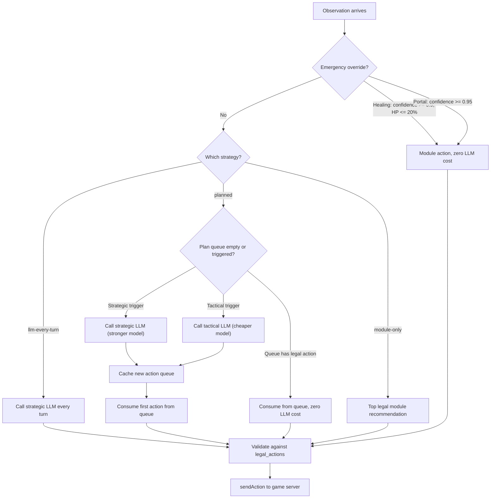

# LLM Adapters and Decision Architecture

The SDK uses LLM calls for two distinct purposes: **game action decisions** and **chat banter**. These are completely isolated -- lobby chat messages never enter the game decision prompt, and game observations never enter the chat prompt. This document covers both, with emphasis on the decision architecture.

## Decision Architecture Overview

The `ActionPlanner` (defined in `src/planner.ts`) sits between the module system and the LLM adapters. It decides _when_ to call the LLM, _which_ model to use, and _whether_ to use a cached plan instead.



## Decision Strategies

### `planned` (default)

The planner maintains a cached action queue. Instead of calling the LLM every turn, it produces a multi-step plan and executes steps from the queue until a trigger invalidates the plan.

**How it works:**

1. On each observation, the planner first checks for emergency overrides (see below).
2. It checks for **strategic triggers** -- major game state changes that warrant a fresh plan from the stronger model.
3. It checks for **tactical triggers** -- combat or trap changes that need a quick replan from the cheaper model.
4. If the queue has a legal next action, it consumes it with zero LLM cost.
5. If the queue is empty (`plan_exhausted`) or the next action is illegal (`action_illegal`), it requests a tactical replan.

**Strategic triggers** (use the strategic LLM):

| Trigger | Condition |
|---------|-----------|
| `initial_observation` | First observation of the run (no previous observation) |
| `floor_change` | `observation.position.floor` differs from previous |
| `realm_status_change` | `observation.realm_info.status` differs from previous |
| `resources_critical` | Healing module flags `criticalHP: true` and `healingAvailable: false` |

**Tactical triggers** (use the tactical LLM):

| Trigger | Condition |
|---------|-----------|
| `combat_start` | Previous turn had 0 visible enemies, current turn has > 0 |
| `combat_end` | Previous turn had > 0 visible enemies, current turn has 0 |
| `trap_triggered` | `recent_events` contains `trap_triggered`, `trap_spotted`, or `trap_damage` |
| `plan_exhausted` | Action queue is empty |
| `action_illegal` | Next queued action is not in `legal_actions` |

**Emergency overrides** (bypass LLM entirely):

- Healing module recommends a legal action with confidence >= 0.9 and character HP is at or below `emergencyHpPercent` (default 20%).
- Portal module recommends a legal action with confidence >= 0.95.

These fire before any strategy check and produce a `PlannerDecision` with `tier: "emergency"`.

### `llm-every-turn`

Calls the strategic LLM on every observation. No plan caching, no tactical model. Simple but expensive.

The planner passes the full observation, module recommendations, legal actions, and recent history to `LLMAdapter.decide()`. The result has `tier: "per-turn"` and `planDepth: 0`.

### `module-only`

Uses only the module heuristics with zero LLM calls. The planner picks the highest-confidence module recommendation that suggests a legal action. If none qualifies, it falls back to `wait`.

Every result has `tier: "module"` and `planDepth: 0`.

## Cost Comparison

Approximate LLM call counts for a typical ~50-turn realm run:

| Strategy | Strategic Calls | Tactical Calls | Total | Relative Cost |
|----------|----------------|----------------|-------|---------------|
| `planned` (tiered) | ~2 | ~5 | ~7 | Lowest |
| `planned` (single model) | ~7 | 0 | ~7 | Low |
| `llm-every-turn` | ~50 | 0 | ~50 | High |
| `module-only` | 0 | 0 | 0 | Free |

The `planned` strategy with tiered models is recommended for production. The stronger model fires only on realm entry and floor changes, while the cheaper model handles combat and trap replans.

## PlannerDecision Metadata

Every decision returned by `ActionPlanner.decideAction()` extends `DecisionResult` with observability fields:

```typescript
interface PlannerDecision extends DecisionResult {
  tier: "strategic" | "tactical" | "module" | "emergency" | "per-turn"
  planDepth: number          // remaining actions in the queue after this one
  triggerReason?: string     // what caused this decision tier to activate
}
```

The `plannerDecision` event on `BaseAgent` emits these, making it straightforward to log which tier handled each turn:

```typescript
agent.on("plannerDecision", (decision) => {
  const trigger = decision.triggerReason ? ` (${decision.triggerReason})` : ""
  console.log(`[${decision.tier}]${trigger} ${decision.reasoning} | queue=${decision.planDepth}`)
})
```

## LLM Adapter Interface

All providers implement this interface:

```typescript
interface LLMAdapter {
  name: string
  decide(prompt: DecisionPrompt): Promise<DecisionResult>
  plan?(prompt: PlanningPrompt): Promise<ActionPlan>
  chat?(prompt: ChatPrompt): Promise<string>
}
```

- `decide()` is required and returns a single action + reasoning.
- `plan()` is optional. If present, the `ActionPlanner` calls it for multi-step plans. If absent, the planner wraps `decide()` into a single-action plan.
- `chat()` is optional and used by `BanterEngine` for lobby chat generation.

All three built-in adapters (OpenRouter, OpenAI, Anthropic) implement all three methods.

### DecisionPrompt

Passed to `decide()`:

```typescript
interface DecisionPrompt {
  observation: Observation
  moduleRecommendations: ModuleRecommendation[]
  legalActions: Action[]
  recentHistory: HistoryEntry[]
  systemPrompt: string
}
```

### PlanningPrompt

Passed to `plan()`:

```typescript
interface PlanningPrompt {
  observation: Observation
  moduleRecommendations: ModuleRecommendation[]
  legalActions: Action[]
  recentHistory: HistoryEntry[]
  systemPrompt: string
  strategicContext?: string    // strategy summary from the last strategic plan
  planType: "strategic" | "tactical"
  maxActions: number           // from DecisionConfig.maxPlanLength
}
```

### ActionPlan

Returned by `plan()`:

```typescript
interface ActionPlan {
  strategy: string              // natural-language strategy summary
  actions: PlannedAction[]      // ordered action queue
}

interface PlannedAction {
  action: Action
  reasoning: string
}
```

## Provider Setup

### OpenRouter

```typescript
import { createLLMAdapter } from "@adventure-fun/agent-sdk"

const llm = createLLMAdapter({
  provider: "openrouter",
  apiKey: process.env.OPENROUTER_API_KEY ?? "",
  model: "anthropic/claude-3.5-haiku",   // default
})
```

- **API endpoint:** `POST https://openrouter.ai/api/v1/chat/completions`
- **Auth:** `Authorization: Bearer <key>`
- **Headers:** `HTTP-Referer: https://adventure.fun`, `X-Title: Adventure.fun Agent`
- **Structured output (auto):** GPT-family models use tool calling; others use `response_format: { type: "json_object" }`
- **Error handling:** 401 (auth), 429 (rate limit with optional `Retry-After`)

### OpenAI

```typescript
const llm = createLLMAdapter({
  provider: "openai",
  apiKey: process.env.OPENAI_API_KEY ?? "",
  model: "gpt-4o-mini",   // default
})
```

- **API endpoint:** `POST https://api.openai.com/v1/chat/completions`
- **Auth:** `Authorization: Bearer <key>`
- **Structured output (auto):** defaults to tool calling (`tools` + `tool_choice`)
- **Tool schema:** registers a `choose_action` function for decisions and `plan_actions` for planning

### Anthropic

```typescript
const llm = createLLMAdapter({
  provider: "anthropic",
  apiKey: process.env.ANTHROPIC_API_KEY ?? "",
  model: "claude-sonnet-4-20250514",   // default
})
```

- **API endpoint:** `POST https://api.anthropic.com/v1/messages`
- **Auth:** `x-api-key: <key>`, `anthropic-version: 2023-06-01`
- **Structured output (auto):** defaults to native `tool_use` blocks with `tool_choice: { type: "tool", name: "choose_action", disable_parallel_tool_use: true }`
- **Default `maxTokens`:** 512

## Structured Output Modes

Each adapter supports three modes via `LLMConfig.structuredOutput`:

| Mode | OpenRouter | OpenAI | Anthropic |
|------|-----------|--------|-----------|
| `"auto"` | `"tool"` if model name contains `gpt`, else `"json"` | `"tool"` | `"tool"` |
| `"json"` | `response_format: { type: "json_object" }` | `response_format: { type: "json_object" }` | Omits tools from request |
| `"tool"` | `tools` + `tool_choice` (forced) | `tools` + `tool_choice` (forced) | `tools` + `tool_choice` (forced) |

The tool schemas use a `oneOf` discriminated union covering all 13 action types (`move`, `attack`, `disarm_trap`, `use_item`, `equip`, `unequip`, `inspect`, `interact`, `use_portal`, `retreat`, `wait`, `pickup`, `drop`).

Response parsing is defensive: if tool calling produces invalid output, the adapter falls back to parsing the text content as JSON, then to extracting balanced JSON objects from fenced code blocks.

## Writing a Custom Adapter

Implement the `LLMAdapter` interface:

```typescript
import type { LLMAdapter, DecisionPrompt, DecisionResult } from "@adventure-fun/agent-sdk"

class MyAdapter implements LLMAdapter {
  name = "my-adapter"

  async decide(prompt: DecisionPrompt): Promise<DecisionResult> {
    // prompt.observation -- current game state
    // prompt.moduleRecommendations -- heuristic analysis
    // prompt.legalActions -- valid actions this turn
    // prompt.systemPrompt -- pre-built system prompt

    const action = prompt.legalActions[0] ?? { type: "wait" }
    return { action, reasoning: "Custom logic" }
  }

  // Optional: implement plan() for multi-step planning
  // Optional: implement chat() for lobby banter
}
```

Pass your adapter to `BaseAgent`:

```typescript
const agent = new BaseAgent(config, {
  llmAdapter: new MyAdapter(),
  walletAdapter: await createWalletAdapter(config.wallet),
})
```

If your adapter does not implement `plan()`, the `ActionPlanner` wraps `decide()` into a single-action plan automatically.

## Shared Prompt Utilities

The SDK exports prompt-building functions that custom adapters can reuse:

| Function | Purpose |
|----------|---------|
| `buildSystemPrompt(config)` | Base game-rules system prompt with action shape documentation |
| `buildStrategicSystemPrompt(config)` | Extends system prompt with multi-turn planning instructions |
| `buildTacticalSystemPrompt(strategicContext?)` | Focused tactical replan instructions |
| `buildDecisionPrompt(observation, recommendations, history)` | Per-turn user prompt with game state |
| `buildPlanningPrompt(prompt)` | Planning user prompt with known map and strategic context |
| `buildActionToolSchema()` | JSON Schema for the `choose_action` tool |
| `buildPlanningToolSchema(maxActions)` | JSON Schema for the `plan_actions` tool |
| `parseActionFromJSON(value, legalActions)` | Validate and match a parsed action against legal actions |
| `parseActionFromText(response, legalActions)` | Extract JSON from text and validate |
| `buildCorrectionMessage(legalActions)` | Retry prompt sent when the LLM returns an invalid action |

These live in `src/adapters/llm/shared.ts` and are re-exported from `src/adapters/llm/index.ts`.

## Prompt Engineering Tips

1. **Lower temperature for decisions.** The default `0.2` works well. Higher values increase action variety but also increase illegal action rates.
2. **Tool calling beats JSON mode** for structured output reliability. Use `structuredOutput: "tool"` unless your model does not support it.
3. **Keep plans short.** `maxPlanLength: 10` is the default. Longer plans are more likely to contain actions that become illegal as game state changes.
4. **Strategic context persists.** The planner passes the strategy summary from the last strategic plan to tactical replans, so the tactical model can maintain the high-level direction.
5. **Module recommendations are advisory.** The system prompt tells the LLM that module recommendations may disagree and should be weighed alongside the live observation.
