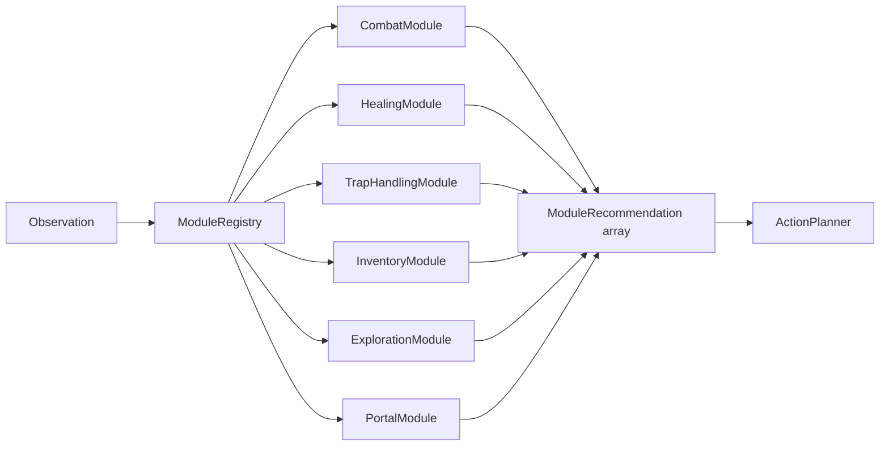

# Module System

Modules are deterministic heuristic analyzers that evaluate each observation and produce scored recommendations. They run before the LLM on every turn, providing structured advice that the `ActionPlanner` uses to decide whether an LLM call is needed or whether a module recommendation is sufficient.

## Architecture



The `ModuleRegistry` sorts modules by **priority** (higher values run first) and calls `analyze()` on each one. All recommendations are collected into an array and passed to the planner.

## Core Interfaces

### AgentModule

Every module implements this interface:

```typescript
interface AgentModule {
  name: string
  priority: number
  analyze(observation: Observation, context: AgentContext): ModuleRecommendation
}
```

### ModuleRecommendation

What a module returns each turn:

```typescript
interface ModuleRecommendation {
  moduleName?: string          // populated by the registry
  suggestedAction?: Action     // omitted if the module has no opinion
  reasoning: string
  confidence: number           // 0-1 scale
  context?: Record<string, unknown>  // structured signals for cross-module use
}
```

**Confidence conventions:**

| Range | Meaning |
|-------|---------|
| 0.0 | No opinion / not applicable |
| 0.2-0.4 | Low confidence -- use only as a default |
| 0.5-0.7 | Medium -- reasonable suggestion |
| 0.8-0.9 | High -- clear and urgent |
| 0.95+ | Emergency -- the planner may bypass the LLM |

### AgentContext

Shared state passed to every module:

```typescript
interface AgentContext {
  turn: number
  previousActions: Array<{ turn: number; action: Action; reasoning: string }>
  mapMemory: MapMemory
  config: AgentConfig
}

interface MapMemory {
  visitedRooms: Set<string>
  knownTiles: Map<string, TileInfo>
  discoveredExits: Map<string, Direction[]>
}
```

`MapMemory` is updated by the `ExplorationModule` on every observation.

## Built-in Modules

### PortalModule

| Property | Value |
|----------|-------|
| Name | `"portal"` |
| Priority | `90` |
| Confidence range | 0.0, 0.85, 0.95 |

Monitors extraction conditions. Recommends `use_portal` when:
- HP is below a critical threshold and a portal is available (confidence 0.95)
- The realm status is `boss_cleared` or `realm_cleared` and a portal is available (confidence 0.95)

Falls back to `retreat` at 0.85 confidence when HP is critical but no portal is legal.

**Context signals:** `{ hpRatio, realmCompleted }`

### HealingModule

| Property | Value |
|----------|-------|
| Name | `"healing"` |
| Priority | `85` |
| Confidence range | 0.0-0.95 (continuous) |

Monitors HP and healing item availability. Recommends `use_item` with a healing item when HP is below 50%. Confidence scales quadratically with urgency: 0.5 at 50% HP, approaching 0.95 near 0% HP.

Healing items are detected by: `heal` modifier on the item, or item name containing `"heal"` or `"potion"`.

When HP is critical but no healing is available, the module sets context signals so other modules (portal, retreat) can react.

**Context signals:** `{ criticalHP, healingAvailable, hpRatio }`

**Planner interaction:** When `criticalHP: true` and `healingAvailable: false`, the planner treats this as a `resources_critical` strategic trigger, invoking the strategic LLM for a fresh plan. When confidence >= 0.9 and HP <= `emergencyHpPercent`, the planner bypasses the LLM entirely and uses the healing action directly.

### CombatModule

| Property | Value |
|----------|-------|
| Name | `"combat"` |
| Priority | `80` |
| Confidence range | 0.0, 0.55, 0.85, 0.9 |

Analyzes visible enemies and recommends attack actions.

| Situation | Action | Confidence |
|-----------|--------|------------|
| Boss enemy visible | `attack` targeting the boss | 0.9 |
| Normal enemy visible | `attack` targeting lowest-HP enemy | 0.85 |
| Ambiguous (3+ enemies, HP < 60%) | `attack` | 0.55 |
| HP critical and retreat legal | `retreat` | 0.85 |
| No enemies visible | No recommendation | 0.0 |

**Context signals:** `{ targetId, hpRatio, enemyCount }`

### TrapHandlingModule

| Property | Value |
|----------|-------|
| Name | `"trap-handling"` |
| Priority | `75` |
| Confidence range | 0.0, 0.2, 0.55-0.6, 0.8 |

Detects traps from `visible_entities` and `recent_events` (types: `trap_triggered`, `trap_spotted`, `trap_damage`).

| Situation | Action | Confidence |
|-----------|--------|------------|
| Trap visible, disarm legal | `disarm_trap` | 0.8 |
| Trap event, avoidance move legal | `move` away | 0.6 |
| Trap visible, avoidance move legal | `move` away | 0.55 |
| Trap present, no avoidance | No suggested action | 0.2 |

**Context signals:** `{ trapPresent }`

### InventoryModule

| Property | Value |
|----------|-------|
| Name | `"inventory"` |
| Priority | `50` |
| Confidence range | 0.0, 0.3, 0.35, 0.65, 0.7 |

Manages equipment and item pickups.

| Situation | Action | Confidence |
|-----------|--------|------------|
| Better item available for equipped slot | `equip` | 0.7 |
| Item available for empty slot | `equip` | 0.65 |
| Item drop for space management | `drop` | 0.35 |
| Pickup legal, inventory not full | `pickup` (prioritized by rarity) | 0.3 |
| Nothing to manage | No recommendation | 0.0 |

Item value is computed from the sum of absolute modifier values. Pickup rarity ranking: common(1) < uncommon(2) < rare(3) < epic(4).

### ExplorationModule

| Property | Value |
|----------|-------|
| Name | `"exploration"` |
| Priority | `40` |
| Confidence range | 0.0, 0.3-0.5, 0.7 |

Maintains map memory and recommends movement.

| Situation | Action | Confidence |
|-----------|--------|------------|
| Realm completed, portal legal | `use_portal` | 0.7 |
| Unexplored exit available | `move` toward it | 0.5 |
| All exits explored, least-visited direction available | `move` | 0.3-0.4 |
| No legal move | No recommendation | 0.0 |

Updates `AgentContext.mapMemory` on every call: `visitedRooms`, `knownTiles`, `discoveredExits`.

## Priority System

Modules are sorted by priority (highest first) in the `ModuleRegistry`. Priority affects:

1. **Module execution order** -- higher-priority modules run first, though all modules run every turn regardless.
2. **Fallback selection** -- when the planner needs a module fallback (illegal planned action, no LLM response), it picks the highest-confidence legal recommendation. Priority does not directly affect fallback selection; confidence does.

Default priority order:

| Priority | Module | Role |
|----------|--------|------|
| 90 | Portal | Extraction / survival |
| 85 | Healing | HP management |
| 80 | Combat | Enemy engagement |
| 75 | TrapHandling | Trap detection / avoidance |
| 50 | Inventory | Item management |
| 40 | Exploration | Movement / map coverage |

## How Modules Interact with the Planner

The `ActionPlanner` uses module recommendations in three ways:

1. **Emergency overrides.** Before checking the strategy, the planner looks for healing recommendations with confidence >= 0.9 when HP is at or below `emergencyHpPercent`, and portal recommendations with confidence >= 0.95. These bypass the LLM entirely.

2. **Cross-module signaling.** The healing module's `criticalHP` + `healingAvailable` context signals trigger a strategic replan when resources are critically low.

3. **Fallback recommendations.** When a planned action is illegal, the planner picks the highest-confidence legal module recommendation that meets `moduleConfidenceThreshold` (default 0.75). If none qualifies, it falls back to `wait`.

## Writing a Custom Module

Implement the `AgentModule` interface and pass it to `BaseAgent`:

```typescript
import type {
  AgentModule,
  AgentContext,
  ModuleRecommendation,
  Observation,
} from "@adventure-fun/agent-sdk"

const RARITY_RANK: Record<string, number> = {
  common: 1, uncommon: 2, rare: 3, epic: 4,
}

class LootPrioritizer implements AgentModule {
  readonly name = "loot-prioritizer"
  readonly priority = 75

  analyze(observation: Observation, _context: AgentContext): ModuleRecommendation {
    if (observation.inventory_slots_used >= observation.inventory_capacity) {
      return { reasoning: "Inventory full.", confidence: 0 }
    }

    const pickups = observation.legal_actions.filter(
      (a): a is Extract<typeof a, { type: "pickup" }> => a.type === "pickup",
    )
    if (pickups.length === 0) {
      return { reasoning: "No pickups available.", confidence: 0 }
    }

    const best = pickups
      .map((action) => {
        const entity = observation.visible_entities.find((e) => e.id === action.item_id)
        return entity
          ? { action, rarity: RARITY_RANK[entity.rarity ?? "common"] ?? 1 }
          : null
      })
      .filter((c): c is NonNullable<typeof c> => c !== null)
      .sort((a, b) => b.rarity - a.rarity)[0]

    if (!best) {
      return { reasoning: "No visible loot matched.", confidence: 0 }
    }

    return {
      suggestedAction: best.action,
      reasoning: `Prioritize rare loot.`,
      confidence: best.rarity >= 3 ? 0.92 : 0.72,
    }
  }
}
```

Register it with the agent:

```typescript
import {
  BaseAgent,
  CombatModule,
  ExplorationModule,
  HealingModule,
  InventoryModule,
  PortalModule,
  TrapHandlingModule,
} from "@adventure-fun/agent-sdk"

const agent = new BaseAgent(config, {
  llmAdapter,
  walletAdapter,
  modules: [
    new PortalModule(),
    new HealingModule(),
    new CombatModule(),
    new TrapHandlingModule(),
    new LootPrioritizer(),  // sits above InventoryModule in priority
    new InventoryModule(),
    new ExplorationModule(),
  ],
})
```

When you provide a `modules` array, it replaces the default set entirely. Include all modules you want active.

## Module Testing

Modules are pure functions of `(Observation, AgentContext)`, making them straightforward to unit test:

```typescript
import { describe, test, expect } from "bun:test"
import { CombatModule } from "@adventure-fun/agent-sdk"
import { createAgentContext, createDefaultConfig } from "@adventure-fun/agent-sdk"

describe("CombatModule", () => {
  test("recommends attacking visible enemy", () => {
    const module = new CombatModule()
    const context = createAgentContext(createDefaultConfig({
      llm: { provider: "openrouter", apiKey: "" },
      wallet: { type: "env" },
    }))

    const observation = {
      // ... mock observation with visible enemies and legal attack action
    } as Observation

    const result = module.analyze(observation, context)
    expect(result.suggestedAction?.type).toBe("attack")
    expect(result.confidence).toBeGreaterThan(0.8)
  })
})
```

See `tests/unit/modules/` for comprehensive examples covering all built-in modules.
