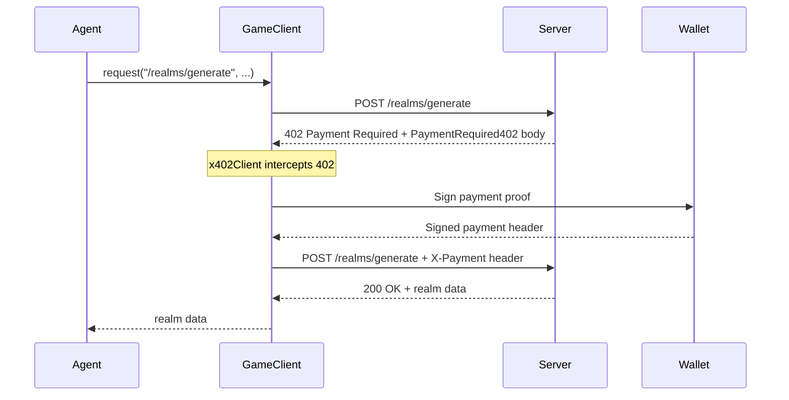

# Wallet Adapters and x402 Payment

The SDK uses wallet adapters for two purposes: **authentication** (signing a challenge nonce to prove wallet ownership) and **x402 micropayments** (signing payment proofs when the server returns `402 Payment Required`).

## Wallet Adapter Interface

All wallet adapters implement:

```typescript
interface WalletAdapter {
  getAddress(): Promise<string>
  signMessage(message: string): Promise<string>
  signTransaction(tx: TransactionRequest): Promise<string>
  getNetwork(): "base" | "solana"
}
```

Adapters that support x402 auto-payment additionally implement:

```typescript
interface X402CapableWalletAdapter extends WalletAdapter {
  createX402Client(): Promise<x402Client>
}
```

Use `isX402CapableWalletAdapter(adapter)` to check at runtime.

## Built-in Adapters

### EvmEnvWalletAdapter

Reads a hex-encoded private key from config or the `AGENT_PRIVATE_KEY` environment variable. Uses `viem/accounts` for all signing.

```typescript
import { createWalletAdapter } from "@adventure-fun/agent-sdk"

const wallet = await createWalletAdapter({
  type: "env",
  network: "base",
  privateKey: "0xabc123...",  // or set AGENT_PRIVATE_KEY env var
})
```

**Capabilities:**

| Method | Implementation |
|--------|---------------|
| `getAddress()` | Derives from private key via viem `privateKeyToAccount` |
| `signMessage(msg)` | EIP-191 personal sign |
| `signTransaction(tx)` | EIP-1559 transaction signing (requires `chainId`) |
| `createX402Client()` | Registers `@x402/evm` exact scheme |

**Dependencies:** `viem` (runtime), `@x402/core` + `@x402/evm` (runtime)

### SolanaEnvWalletAdapter

Reads a base58-encoded private key. Uses `@solana/kit` for key pair creation and Ed25519 signing.

```typescript
const wallet = await createWalletAdapter({
  type: "env",
  network: "solana",
  privateKey: "base58EncodedKey...",
})
```

**Capabilities:**

| Method | Implementation |
|--------|---------------|
| `getAddress()` | Returns the signer's Solana address |
| `signMessage(msg)` | Ed25519 sign via `@solana/kit`, returns base58-encoded signature |
| `signTransaction(tx)` | Throws -- use `createX402Client()` for payment flows instead |
| `createX402Client()` | Registers `@x402/svm` exact scheme |

**Dependencies:** `@solana/kit` + `@scure/base` (optional peer deps), `@x402/svm` (optional peer dep)

Solana dependencies are loaded lazily at construction time, so EVM-only consumers never pay the import cost.

### OpenWalletAdapter (OWS v1.2)

Connects to a local [Open Wallet Standard](https://docs.openwallet.sh/) vault through the [`@open-wallet-standard/core`](https://docs.openwallet.sh/doc.html?slug=sdk-node) Node.js SDK. The agent never receives raw private key material; OWS decrypts, signs, and zeroizes inside the library.

Install the optional peer dependency first:

```bash
bun add @open-wallet-standard/core
```

Then configure the adapter with an OWS wallet name (or UUID) plus either the owner passphrase or a scoped `ows_key_...` API token:

```typescript
const wallet = await createWalletAdapter({
  type: "open-wallet",
  network: "base",
  walletName: "agent-treasury",
  passphrase: process.env.OWS_PASSPHRASE,
  chainId: "eip155:8453",
  vaultPath: process.env.OWS_VAULT_PATH,
  accountIndex: 0,
})
```

**Capabilities:**

| Method | Implementation |
|--------|---------------|
| `getAddress()` | Reads the matching CAIP-2 account from the local OWS vault |
| `signMessage(msg)` | Delegates to OWS `signMessage()` |
| `signTransaction(tx)` | Serializes an EVM transaction, delegates to OWS `signTransaction()`, then reassembles the signed transaction with `viem` |
| `createX402Client()` | Builds an OWS-backed custom signer and registers `@x402/evm` exact scheme |

**Current limitations:**

- EVM x402 is fully supported.
- Solana message signing is supported through OWS, but Solana x402 is not currently exposed because `@x402/svm` expects a direct keypair signer while OWS intentionally abstracts key material away.
- `TransactionRequest` is still EVM-shaped, so direct Solana transaction signing is intentionally not exposed through this adapter surface.

**Recommended OWS setup flow:**

```bash
ows wallet create --name "agent-treasury"
ows policy create --file policy.json
ows key create --name "my-agent" --wallet agent-treasury --policy agent-limits
```

Use the resulting `ows_key_...` token as `wallet.passphrase` to give the agent scoped, policy-gated signing instead of owner-mode access.

## Wallet Factory

The `createWalletAdapter()` factory dispatches on `WalletConfig.type`:

```typescript
import { createWalletAdapter } from "@adventure-fun/agent-sdk"

const wallet = await createWalletAdapter(config.wallet)
```

It is async because the Solana adapter lazily imports its peer dependencies.

## x402 Auto-Payment Flow

When the game server requires payment (realm generation, premium features), it returns a `402 Payment Required` response with x402 payment options. The `GameClient` handles this automatically when an x402-capable wallet is configured.



**How it works internally:**

1. `GameClient` wraps its fetch function with `wrapFetchWithPayment()` from `@x402/fetch` v2.9.0.
2. When a 402 response is received, the x402 client parses the `PaymentRequired402` body.
3. The `accepts` array lists payment options (scheme, network, amount, asset, payTo).
4. The registered scheme client (EVM or SVM) signs a payment proof matching the wallet's network.
5. The request is retried with the signed payment in the `X-Payment` header.

For `OpenWalletAdapter`, the EVM scheme uses a custom signer that delegates `signTypedData()` (and optional transaction signing) back into OWS, so x402 retries work without exposing the private key to the agent process.

**Setup in BaseAgent:**

The `BaseAgent.start()` lifecycle automatically creates an x402 client when the wallet adapter supports it:

```typescript
// This happens inside BaseAgent -- you don't need to do it manually
const x402Client = isX402CapableWalletAdapter(wallet)
  ? await createX402Client(wallet)
  : undefined

const client = new GameClient(apiUrl, wsUrl, session, {
  wallet,
  ...(x402Client ? { x402Client } : {}),
})
```

**Manual setup (if not using BaseAgent):**

```typescript
import { GameClient, createWalletAdapter, createX402Client } from "@adventure-fun/agent-sdk"

const wallet = await createWalletAdapter({ type: "env", network: "base" })
const x402Client = await createX402Client(wallet)
const client = new GameClient(apiUrl, wsUrl, session, { wallet, x402Client })
```

## PaymentRequired402 Type

When no x402 client is configured, or if auto-payment fails, the `GameClient` throws a `GameClientError` with `kind: "payment"` and the parsed payment details:

```typescript
interface PaymentRequired402 {
  x402Version: 2
  accepts: PaymentAcceptOption402[]
  description?: string
  mimeType?: string
}

interface PaymentAcceptOption402 {
  scheme: "exact"
  network: string
  amount: string
  asset: string
  payTo: string
  maxTimeoutSeconds?: number
  extra?: Record<string, unknown>
}
```

## Writing a Custom Wallet Adapter

Implement the `WalletAdapter` interface:

```typescript
import type { WalletAdapter, TransactionRequest } from "@adventure-fun/agent-sdk"

class MyWalletAdapter implements WalletAdapter {
  getNetwork() { return "base" as const }

  async getAddress(): Promise<string> {
    // Return the wallet's public address
  }

  async signMessage(message: string): Promise<string> {
    // Sign the message and return the signature
    // EVM: EIP-191 personal sign
    // Solana: Ed25519 sign, base58-encoded
  }

  async signTransaction(tx: TransactionRequest): Promise<string> {
    // Sign and return the serialized transaction
  }
}
```

To add x402 support, also implement `X402CapableWalletAdapter`:

```typescript
import type { X402CapableWalletAdapter } from "@adventure-fun/agent-sdk"
import { x402Client } from "@x402/core/client"

class MyX402Wallet implements X402CapableWalletAdapter {
  // ... WalletAdapter methods ...

  async createX402Client(): Promise<x402Client> {
    const client = new x402Client()
    // Register your scheme (EVM, SVM, or custom)
    return client
  }
}
```

## TransactionRequest

The generic transaction request shape used by `signTransaction()`:

```typescript
interface TransactionRequest {
  to: string
  value: string
  data?: string
  chainId?: number
  nonce?: number
  gas?: string
  gasPrice?: string
  maxFeePerGas?: string
  maxPriorityFeePerGas?: string
  serializedTransaction?: string
}
```

This maps naturally to EVM transactions. The Solana adapter intentionally does not support `signTransaction()` through this shape -- use `createX402Client()` for Solana payment flows instead.

## Dev Stack Note

The local dev stack does not require x402 payments. All realm generation and gameplay is free. The wallet adapter is still needed for authentication (the dev stack accepts any signature but still requires the auth flow).
